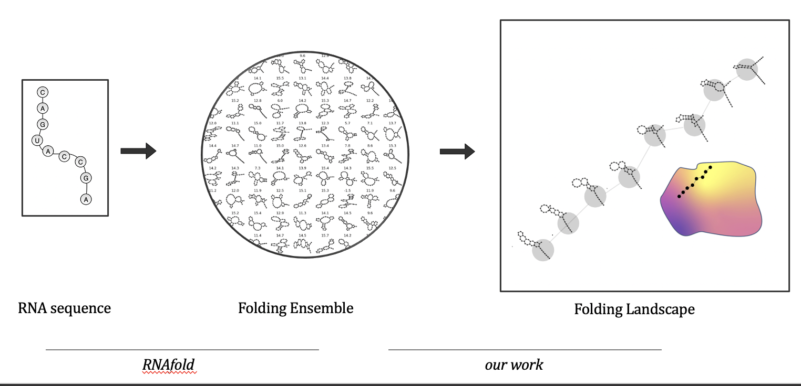

<div align="center">    
 
# Uncovering the Folding Landscape of RNA Secondary Structure with Deep Graph Embeddings
<!-- 
[](https://arxiv.org/abs/2006.06885)

[](https://papers.nips.cc/book/advances-in-neural-information-processing-systems-31-2018)  
 -->

[](https://arxiv.org/abs/2006.06885)
[](https://ieeexplore.ieee.org/document/9378305)


<!--  
Conference   
-->   
</div>
 
## Visual Description   


## How to run   
First, install dependencies   
```bash
# clone project   
git clone https://github.com/ec134/GSAE   

# IT IS RECOMMENDED THAT YOU WORK WITHIN A VIRTUAL ENVIRONMENT
# install project   
cd GSAE
pip install -e .   
pip install -r requirements.txt

 ```   
 
 You will also need to install PyTorch Geometric. Instructions for doing so can be found [here](https://pytorch-geometric.readthedocs.io/en/latest/notes/installation.html)
 
 
 # Workflow

## 1. Loading data from RNAfold
---


From RNAfold, we get a file like the following

    rnafold_output.txt

which inside looks like

    GGCGUUUUCGCCUUUUGGCGAUUUUUAUCGCC -14.20  10.00
    (.((...(((((....))))).......)).)  -5.50
    (.(((..(((((....))))).....).)).)  -4.20
    ((.....(((((....))))).........))  -5.90
    ((.((..(((((....))))).....))..))  -5.60
    ((.(...(((((....))))).......).))  -6.40
    ((.(.(.(((((....))))).....).).))  -4.20
    ((.((..(((((....))))).....).).))  -5.10
    (((....(((((....))))).(...)..)))  -4.30
    (((....(((((....)))))(....)..)))  -5.30


RNAfold output files used in the paper are included in 

    data/raw_data/


We can use `rnafold2arrays.py` in `gsae/data_processing` to convert this text file to

- a csv file containing adjacency matrices for each fold (`adjmats_<datestamp>.csv`)
- a csv file containing the energy scalar for each structure (`energies_<datestamp>.csv`)
- a text file with the rna sequence (`sequence_<datestamp>.txt`)

`rnafold2arrays.py` usage:

    usage: rnafold2arrays.py [-h] --data DATA --outname OUTNAME

    optional arguments:
    -h, --help         show this help message and exit
    --data DATA        RNAfold txt file output to be converted
    --outname OUTNAME  base name for the outputs

sample usage:

    > python rnafold2arrays.py --data seq4_rnafold_out.txt --outname seq4


Which will produce the following files

    seq4_adjmat_2020-03-04-03.csv
    seq4_energies_2020_03-04-03.csv
    seq4_sequence_2020-03-04-03.txt


#### If you would like to skip this step, you can also download the processed files from this [box link](https://yale.box.com/s/3r539p1yp6aencpv8hlyexolq27yudpm).  The file is named **processed_data.tar.gz**


## 2. Converting adjacency data to scattering coefficients
---


Once we have the adjacency matrices of the structures we're interested in, we can convert them using scattering transforms to a new, more informative representation

Here we will use diracs centered at each node (i.e. the identity matrix) as our graph signals.

To convert them, we will use `adj2scatcoeffs.py`

    usage: adj2scatcoeffs.py [-h] --data DATA --outname OUTNAME [--pcs PCS]

    optional arguments:
    -h, --help         show this help message and exit
    --data DATA        file (npy or csv) with adjacency matrices
    --outname OUTNAME  base name for output
    --pcs PCS          how many principle components to use (if 0, then use raw scattering coefficients)

sample usage:

    > python adj2scatcoeffs.py --data seq4_adjmat_2020-03-04-03.csv --outname seq_4

#### If you would like to skip this step, you can also download the processed files from this [box link](https://yale.box.com/s/3r539p1yp6aencpv8hlyexolq27yudpm). The file is named **scattering_coeffs.tar.gz**
## 3. Create Splits
---


Now that we've generated all the data our model will use, we can now create the train/test splits

To convert them, we will use `create_splits.py`

    usage: create_splits.py [-h] --adjs ADJS --coeffs COEFFS --energies ENERGIES --outname OUTNAME

    optional arguments:
    -h, --help           show this help message and exit
    --adjs ADJS          file with adjacency matrices
    --coeffs COEFFS      file with scattering coeffs
    --energies ENERGIES  file with energy values
    --outname OUTNAME    base name for output

The output set of files can be then stored in a directory which we will later refer to as `ROOT_DIR` for the reason mentioned below

#### If you would like to skip this step, you can also download the processed files from this [box link](https://yale.box.com/s/3r539p1yp6aencpv8hlyexolq27yudpm). The file is named **final_splits.tar.gz**

## IMPORTANT: Data loading for models

In order to ensure that the training scripts in the model files function correctly, the `ROOT_DIR` variable at the top of `load_splits.py` to where the train/test split is located 


## Data

Data for the 4 sequences used in the paper are located in data/


    └── raw_data
        ├── hiv_tar
        │   ├── hiv_tar_sequence.txt
        │   ├── hivtar_100k_subp_n_052020.txt
        ├── hob_seq3
        │   ├── seq3_100k_subp_n_052020.txt
        │   └── seq3_sequence.txt
        ├── hob_seq4
        │   ├── seq4_100k_subp_n_052020.txt
        │   └── seq4_sequence.txt
        └── tebown
            ├── teb_100k_subp_n_052020.txt
            └── tebown_sequence.txt

## Training the models

To train the GSAE:

    python train_gsae.py

To train the GAE or GVAE models:

    python train_gnn.py

The scattering inversion network if found ins 

    gsae/models/inv_scattering.py
### Citation   
```
@inproceedings{castro2020uncovering,
  title={Uncovering the Folding Landscape of RNA Secondary Structure Using Deep Graph Embeddings},
  author={Castro, Egbert and Benz, Andrew and Tong, Alexander and Wolf, Guy and Krishnaswamy, Smita},
  booktitle={2020 IEEE International Conference on Big Data (Big Data)},
  pages={4519--4528},
  year={2020},
  organization={IEEE}
}
```   
